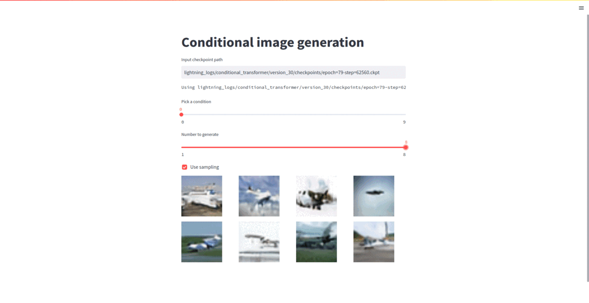

## VQGAN

I'm trying out a vqgan from https://arxiv.org/pdf/2012.09841.pdf.
Just on Cifar10.

### Results

I trained the vqgan, then trained a gpt2 model with 3 layers (22 million params) to generate the discrete latent codes to then be decoded into images, here's a gif of the streamlit app:

